# cp-template-cpp

C++23 競技プログラミングテンプレート (AtCoder 等向け)

---

## 目次

- [型エイリアス](#型エイリアス)
- [定数](#定数)
- [マクロ](#マクロ)
- [ユーティリティ関数](#ユーティリティ関数)
- [modint](#modint)
- [math 名前空間](#math-名前空間)
- [structure 名前空間](#structure-名前空間)
- [binary\_search 名前空間](#binary_search-名前空間)
- [座標圧縮 Compress](#座標圧縮-compress)
- [累積和](#累積和)
- [ローリングハッシュ RollingHash](#ローリングハッシュ-rollinghash)
- [graph 名前空間](#graph-名前空間)
- [依存関係マップ](#依存関係マップ)

---

## 型エイリアス

| エイリアス | 型 |
|---|---|
| `ll` | `long long` |
| `ld` | `long double` |
| `ull` | `unsigned long long` |
| `pii` | `pair<int, int>` |
| `pll` | `pair<ll, ll>` |
| `vi` | `vector<int>` |
| `vl` | `vector<ll>` |
| `vvi` | `vector<vector<int>>` |
| `vvl` | `vector<vector<ll>>` |
| `vb` | `vector<bool>` |
| `vvb` | `vector<vector<bool>>` |
| `vs` | `vector<string>` |

---

## 定数

| 定数 | 値 | 用途 |
|---|---|---|
| `INF` | `1e9` | int の無限大・未到達の初期値 |
| `LINF` | `1e18` | ll の無限大・未到達の初期値 |
| `MOD` | `1e9 + 7` | 答えを mod で求める問題の定番素数 |
| `MOD998` | `998244353` | NTT フレンドリーな素数。問題文に指定がある場合に使う |
| `PI` | `M_PI` | 幾何・三角関数を使う問題 |
| `EPS` | `1e-9` | 実数比較の誤差吸収 (`abs(a-b) < EPS` で等値判定) |

### グリッド方向配列

| 配列 | 内容 | 使う場面 |
|---|---|---|
| `dx4`, `dy4` | 上下左右 4 方向 | 迷路・BFS・島の数え上げなど移動が 4 方向の問題 |
| `dx8`, `dy8` | 斜め込み 8 方向 | チェスのキング移動・斜め移動が許可される問題 |

---

## マクロ

### ループ

| マクロ | 展開 | 使う場面 |
|---|---|---|
| `rep(i, n)` | `for (int i = 0; i < n; ++i)` | 0-indexed の基本ループ |
| `rep1(i, n)` | `for (int i = 1; i <= n; ++i)` | 1-indexed でループしたい時 |
| `rrep(i, n)` | `for (int i = n-1; i >= 0; --i)` | 後ろから走査、DP の逆順更新 |
| `fore(i, a)` | `for (auto& i : a)` | コンテナの全要素を参照で走査 |

### コンテナ操作

| マクロ | 展開 |
|---|---|
| `all(v)` | `v.begin(), v.end()` |
| `rall(v)` | `v.rbegin(), v.rend()` |
| `pb` | `push_back` |
| `eb` | `emplace_back` |
| `mp` | `make_pair` |
| `fi` | `first` |
| `se` | `second` |

### デバッグ

コンパイル時に `-DLOCAL` を付けると有効になり、本番提出時は自動で無効化される。
`pair`, `vector`, `set`, `map` をそのまま `cerr` に流せる。

```cpp
debug(x, y, z);          // [x, y, z]: 1 2 3
debug(v);                 // [v]: [1, 2, 3]
debug(mp(1, "abc"));     // [(1, "abc")]
```

---

## ユーティリティ関数

### chmin / chmax

DP の遷移でほぼ毎回使う。「更新が発生したか」を返すので条件分岐にも使える。

```cpp
chmin(dp[i], dp[j] + cost);  // dp[i] = min(dp[i], dp[j] + cost)
chmax(ans, val);
```

> **使う場面**: DP の最小/最大値更新、グラフの距離更新

### fastio

入力が大量にある問題では必ず冒頭で呼ぶ。`endl` をマクロで `'\n'` に置き換えているので合わせて使う。

```cpp
fastio();
```

> **注意**: `fastio()` 後は `scanf`/`printf` と混在させないこと

### 入力ヘルパー

```cpp
auto x = input<ll>();               // 1 値読み込み
auto v = input_vec<ll>(n);          // n 要素の 1 次元配列
auto g = input_vec2<ll>(n, m);      // n×m の 2 次元配列
```

### 出力ヘルパー

```cpp
print_vec(v);           // スペース区切りで出力 + 改行
print_vec(v, "\n");     // 1 行 1 要素で出力したい時
```

### 2 次元ベクトル初期化

```cpp
auto dp = vv<ll>(n, m, LINF);   // n×m の DP テーブルを LINF で初期化
auto g  = vv<int>(n, n, INF);   // グラフの距離行列を INF で初期化
```

---

## modint

「答えを `1e9+7` で割った余りを求めよ」という問題で使う。
通常の整数型と同じ感覚で四則演算が書けるため、mod 計算のバグを防げる。

| 型 | MOD | 使う場面 |
|---|---|---|
| `mint` | `1e9 + 7` | 問題文に `mod 10^9+7` と書かれている場合 |
| `mint998` | `998244353` | 問題文に `mod 998244353` と書かれている場合 |

四則演算 (`+`, `-`, `*`, `/`)、累乗 (`.pow(n)`)、逆元 (`.inv()`)、`cin`/`cout` に対応。

```cpp
mint a = 3, b = 5;
mint c = a * b + a.pow(10);   // 自動で mod が掛かる
cout << c << "\n";
cin >> a;                      // そのまま入力も受け取れる
```

> **使う場面**: 経路数・場合の数の DP、組み合わせ数の計算、行列累乗

---

## math 名前空間

### pow_mod

`modint` が使えない場面（MOD が固定でない・ll のまま扱いたい）で使う。

```cpp
ll r = math::pow_mod(a, n, m);  // a^n mod m、O(log n)
```

> **使う場面**: MOD が問題ごとに異なる場合、フェルマーの小定理による逆元計算

### is_prime

1 つの数が素数か判定するだけでよい場合に使う。大量に判定するなら `sieve` の方が速い。

```cpp
bool ok = math::is_prime(n);  // O(√n)
```

> **使う場面**: 素数に関する条件分岐、素数のみカウントする問題

### sieve / prime_list

ある上限以下の素数を列挙したい時に使う。

```cpp
auto is_p = math::sieve(n);       // is_p[i] == true なら i は素数
auto ps   = math::prime_list(n);  // n 以下の素数一覧
```

> **使う場面**: 複数の数について素数判定が必要な場合、素数の個数を数える問題
> **計算量**: O(n log log n)

### factorize

```cpp
auto f = math::factorize(12);
// f = {(2, 2), (3, 1)}  → 12 = 2^2 × 3^1
```

> **使う場面**: 素因数の個数・種類を使う問題、約数の個数を求める問題（指数に +1 して掛け合わせる）
> **計算量**: O(√n)

### divisors

```cpp
auto d = math::divisors(12);  // d = {1, 2, 3, 4, 6, 12}
```

> **使う場面**: 約数全列挙、「n の約数についてすべて〜」という問題
> **計算量**: O(√n)

### extgcd

`ax + by = gcd(a, b)` を満たす整数 `x`, `y` を求める。

```cpp
ll x, y;
ll g = math::extgcd(a, b, x, y);  // g = gcd(a, b)
```

> **使う場面**: MOD が素数でない場合の逆元、中国剰余定理 (CRT)、線形ディオファントス方程式

### combination

nCk や nPk を大量に求める場合に前計算しておく。

```cpp
math::combination C(200000);  // 最大 n まで前計算 (O(n))
ll c = C(n, k);               // nCk mod MOD、O(1)
ll p = C.perm(n, k);          // nPk mod MOD、O(1)
```

> **使う場面**: 場合の数の DP、確率・期待値問題、二項係数を何度も使う問題
> **注意**: `MOD` がデフォルト。問題によって `combination C(n, MOD998)` と指定可能

---

## structure 名前空間

### BIT (Binary Indexed Tree / Fenwick Tree)

1 点加算と区間和を O(log n) で処理するデータ構造。SegTree より定数が小さく速い。

```cpp
structure::BIT<ll> bit(n);
bit.add(i, x);       // i 番目 (0-indexed) に x を加算
bit.sum(l, r);       // [l, r) の総和
bit.get(i);          // i 番目の値を取得
bit.set(i, x);       // i 番目の値を x に更新
```

> **使う場面**:
> - 転倒数の計算（自分より左にある自分より大きい要素の数）
> - 動的に更新しながら区間和を求める
> - Compress と組み合わせて座標圧縮後の BIT
>
> **計算量**: 更新 O(log n)、クエリ O(log n)

### UnionFind

グループの統合・判定を高速に行うデータ構造。

```cpp
structure::UnionFind uf(n);
uf.unite(x, y);  // x と y を同じグループに統合。統合済みなら false
uf.same(x, y);   // 同じグループか判定
uf.find(x);      // x の根（代表元）を返す
uf.size(x);      // x が属するグループのサイズ
```

> **使う場面**:
> - グラフの連結成分判定
> - クエリを後ろから処理して辺を追加していく（オフライン処理）
> - Kruskal 法（MST）の補助
> - 「グループが何個あるか」「同じグループか」の問い合わせが多い問題
>
> **計算量**: ほぼ O(1) (アッカーマン逆関数)

### WeightedUnionFind

「ノード間の重みの差」を管理できる UnionFind。

```cpp
structure::WeightedUnionFind<ll> wuf(n);
wuf.unite(x, y, cost);  // weight(y) - weight(x) = cost となるよう統合
wuf.diff(x, y);         // weight(y) - weight(x) を返す（同一成分のみ有効）
wuf.same(x, y);         // 同じ連結成分か
```

> **使う場面**:
> - 相対的な差が与えられる問題（「A は B より 3 大きい」等）
> - 差分制約問題の簡易版
> - 同グループ内での値の大小・差を管理する必要がある問題

### SegTree (セグメント木)

任意のモノイド演算について区間クエリ・点更新を行う。

```cpp
// 例1: 区間最小値 (RMQ)
structure::SegTree<ll> seg(n, LINF, [](ll a, ll b){ return min(a, b); });
// 例2: 区間和
structure::SegTree<ll> seg(n, 0LL, [](ll a, ll b){ return a + b; });
// 例3: 区間最大値
structure::SegTree<ll> seg(n, -LINF, [](ll a, ll b){ return max(a, b); });

seg.update(i, val);  // i 番目を val に更新 (0-indexed)
seg.query(l, r);     // [l, r) の演算結果
```

> **使う場面**:
> - 点更新 + 区間クエリが必要な問題
> - BIT で扱えない演算（最大・最小・GCD など）
> - 「左から i 番目の要素を更新しながら区間の最大値を求める」
>
> **計算量**: 更新 O(log n)、クエリ O(log n)

### LazySegTree (遅延伝播セグメント木)

区間更新と区間クエリを両方扱える。SegTree の上位互換だが設定が複雑。

```cpp
// 例: 区間加算 + 区間最小値クエリ
// f: min 演算、g: 加算を適用、h: 作用素の合成（加算同士は足し算）
structure::LazySegTree<ll, ll> seg(
    n, LINF, 0LL,
    [](ll a, ll b){ return min(a, b); },  // f
    [](ll a, ll u){ return a + u; },      // g
    [](ll a, ll b){ return a + b; }       // h
);
seg.update(l, r, x);  // [l, r) の全要素に x を加算
seg.query(l, r);      // [l, r) の最小値
```

> **使う場面**:
> - 「区間に一様加算して区間最小/最大/和を求める」
> - 「区間を一様に書き換えて区間和を求める」
> - SegTree で TLE する場合（区間更新を O(n) でやっている場合）
>
> **計算量**: 更新 O(log n)、クエリ O(log n)

---

## binary_search 名前空間

「条件を満たす最大/最小の値を求めよ」という問題で使う。
条件が単調（ある値以下は全部 OK、以上は全部 NG など）であれば適用可能。

```cpp
// 「f(x) == true となる最大の整数 x」を求める
// ok: true になることが分かっている値、ng: false になることが分かっている値
ll ans = binary_search::binary_search_left(ok, ng, [&](ll mid){
    return check(mid);  // mid が条件を満たすなら true
});

// 「f(x) == true となる最小の整数 x」を求める
ll ans = binary_search::binary_search_right(ng, ok, [&](ll mid){
    return check(mid);
});

// 実数二分探索（デフォルト 100 回反復）
double ans = binary_search::binary_search_real(0.0, 1e9, [&](double mid){
    return check(mid);
});
```

> **使う場面**:
> - 「最大化せよ / 最小化せよ」という問題で答えを二分探索（パラメータ探索）
> - 「コスト X 以内で条件を達成できるか？」という判定問題に落とす
> - `lower_bound` / `upper_bound` を自前条件で書きたい場合
> - 実数解を求める問題（最小コスト・最適化）

---

## 座標圧縮 Compress

値の種類数は少ないが値そのものが大きい場合に、0-indexed の小さい整数に変換する。
BIT や SegTree のインデックスとして使うのが典型。

```cpp
Compress<ll> comp;
comp.add(v);      // vector の全要素を登録
comp.add(x);      // 1 要素を追加
comp.build();     // ソート・重複除去（add 後に必ず呼ぶ）

int idx = comp.get(x);   // x の圧縮後インデックス (0-indexed)
int sz  = comp.size();   // 圧縮後の種類数
ll val  = comp[i];       // 元の i 番目の値（逆引き）
```

> **使う場面**:
> - 座標値が最大 `1e18` だが種類数が `N` 以下の場合
> - 「値の大小関係は必要だが具体的な値は不要」という問題
> - BIT + 座標圧縮で転倒数・区間カウント

---

## 累積和

### CumulativeSum (1 次元)

配列の区間和を O(1) で求める。更新は不可（静的）。

```cpp
CumulativeSum<ll> cs(n);
rep(i, n) cs.add(i, a[i]);  // または cs.add(i, x) で各要素を加算
cs.build();                  // 必ず build() してから使う
ll s = cs.sum(l, r);         // a[l] + a[l+1] + ... + a[r-1]
```

> **使う場面**:
> - 「区間 [l, r) の和を複数回求める」
> - しゃくとり法・二分探索と組み合わせて条件を満たす区間を探す
> - 差分配列の代わりに使う

### CumulativeSum2D (2 次元)

矩形領域の総和を O(1) で求める。

```cpp
CumulativeSum2D<ll> cs2(h, w);
rep(i, h) rep(j, w) cs2.add(i, j, grid[i][j]);
cs2.build();
ll s = cs2.sum(i1, j1, i2, j2);  // 行 [i1,i2)、列 [j1,j2) の矩形和
```

> **使う場面**:
> - グリッド上の矩形領域の合計を複数回求める問題
> - 「h×w のグリッドで条件を満たす部分矩形を数える」

---

## ローリングハッシュ RollingHash

Mersenne 素数 `2^61 - 1` を法とする衝突率の低いハッシュ。

```cpp
RollingHash rh(s);
uint64_t h  = rh.get(l, r);              // s[l..r) のハッシュ値
bool eq     = rh.match(l1, r1, l2, r2); // 2 部分文字列が等しいか O(1)
// 2 つのハッシュを連結（s1 + s2 のハッシュを求める）
uint64_t combined = RollingHash::connect(h1, h2, len2);
```

> **使う場面**:
> - 「文字列 S に文字列 T が含まれるか」（KMP の代替）
> - 「2 つの部分文字列が等しいか」を O(1) で判定
> - 回文判定（正順・逆順のハッシュを比較）
> - 「同じ部分文字列が何種類あるか」（二分探索と組み合わせ）
>
> **注意**: 多倍長ハッシュを使いたい場合は base を 2 つ用意して両方一致を確認する

---

## graph 名前空間

### Dijkstra

非負重み付きグラフの単一始点最短経路。

```cpp
// g[v] = {(隣接頂点 u, 辺の重み cost), ...}
vector<vector<pair<int,ll>>> g(n);
g[u].eb(v, cost);
auto dist = graph::dijkstra(g, s);  // dist[v] = s→v の最短距離（未到達は LINF）
```

> **使う場面**:
> - 重み付きグラフで「最短コストで移動できるか」
> - グリッドでマス移動にコストがある問題
> - 「K 回以内で到達できる最小コスト」(状態を (頂点, 残り回数) に拡張)
>
> **計算量**: O((V + E) log V)
> **注意**: 負の辺がある場合は使えない（ベルマンフォードを使う）

### BFS

重みなしグラフ・グリッドの最短経路。

```cpp
// g[v] = {隣接頂点, ...}
auto dist = graph::bfs(g, s);  // dist[v] = s→v の最短距離（辺数）、未到達は -1
```

> **使う場面**:
> - 迷路の最短手数
> - 0-1 BFS（辺の重みが 0 か 1 の場合は deque で拡張）
> - 連結成分の分類
>
> **計算量**: O(V + E)

### Warshall-Floyd

全頂点間の最短経路を一括計算する。

```cpp
// dist[i][j] = i→j の距離（辺なし = LINF、自己ループ = 0）
auto dist = vv<ll>(n, n, LINF);
rep(i, n) dist[i][i] = 0;
// 辺の追加
dist[u][v] = cost;
graph::warshall_floyd(dist);
// 負閉路の検出: dist[i][i] < 0 の頂点が存在する場合
```

> **使う場面**:
> - 全頂点間の最短距離が必要な問題
> - 「任意の 2 頂点間を経由するコスト」
> - 閉路検出
>
> **計算量**: O(V^3)
> **注意**: V が 500 程度以下でないと TLE になる

### topological_sort

DAG の頂点を依存関係順に並べる（Kahn's algorithm）。

```cpp
// g[v] = {v から出る辺の先の頂点}
auto order = graph::topological_sort(g);
if (order.empty()) {
    // DAG でない（閉路が存在する）
}
```

> **使う場面**:
> - 「タスクの実行順序を求める」
> - DAG 上の DP（最長経路・経路数）
> - 「A の前に B を処理する必要がある」という依存関係の解決
> - 閉路の有無を判定する（空ならサイクルあり）
>
> **計算量**: O(V + E)

### kruskal (最小全域木)

辺コストの合計が最小になる全域木を求める。

```cpp
// edges[i] = {コスト, {頂点 u, 頂点 v}}
vector<pair<ll, pii>> edges;
edges.eb(cost, mp(u, v));
auto [total, used] = graph::kruskal(n, edges);
// total: MST の総コスト
// used:  採用した辺のリスト
```

> **使う場面**:
> - 「N 地点を最小コストで全て連結する」
> - 「最大コストの辺を最小にしてグラフを連結する（ミニマックスパス）」
> - 「余分な辺を取り除いて木にする」
>
> **計算量**: O(E log E)

### LCA (最小共通祖先)

根付き木上で 2 頂点の最も深い共通祖先をダブリングで求める。

```cpp
// g: 無向隣接リスト（木）
graph::LCA lca(g, 0);         // root = 0 で前計算
int anc = lca.lca(u, v);     // u と v の LCA ノード番号
int d   = lca.dist(u, v);    // u-v 間のパス長（辺数）
int dep = lca.depth[v];      // v の深さ（根からの距離）
```

> **使う場面**:
> - 「木上の 2 頂点間のパスに関するクエリ」
> - 「u-v 間のパスの長さ」= `depth[u] + depth[v] - 2*depth[lca(u,v)]`
> - BIT/SegTree と組み合わせたパスクエリ（Heavy-Light Decomposition の前段）
>
> **前計算**: O(n log n)、**クエリ**: O(log n)

---

## 依存関係マップ

```mermaid
graph TD
    BIT["structure::BIT"]
    UF["structure::UnionFind"]
    WUF["structure::WeightedUnionFind"]
    SEG["structure::SegTree"]
    LAZY["structure::LazySegTree"]
    COMB["math::combination"]
    KRUSKAL["graph::kruskal"]
    LCA["graph::LCA"]
    MODINT["modint / mint / mint998"]
    COMPRESS["Compress"]
    CS["CumulativeSum"]
    CS2["CumulativeSum2D"]
    RH["RollingHash"]
    DIJKSTRA["graph::dijkstra"]
    BFS["graph::bfs"]
    WF["graph::warshall_floyd"]
    TOPO["graph::topological_sort"]

    KRUSKAL --> UF
    COMB --> MODINT
    LCA --> BFS
```


