# cp-template-cpp

C++23 競技プログラミングテンプレート (AtCoder 等向け)

---

## 目次

- [型エイリアス](#型エイリアス)
- [定数](#定数)
- [マクロ](#マクロ)
- [ユーティリティ関数](#ユーティリティ関数)
- [modint](#modint)
- [math 名前空間](#math-名前空間)
- [structure 名前空間](#structure-名前空間)
- [binary\_search 名前空間](#binary_search-名前空間)
- [座標圧縮 Compress](#座標圧縮-compress)
- [累積和](#累積和)
- [ローリングハッシュ RollingHash](#ローリングハッシュ-rollinghash)
- [graph 名前空間](#graph-名前空間)

---

## 型エイリアス

| エイリアス | 型 |
|---|---|
| `ll` | `long long` |
| `ld` | `long double` |
| `ull` | `unsigned long long` |
| `pii` | `pair<int, int>` |
| `pll` | `pair<ll, ll>` |
| `vi` | `vector<int>` |
| `vl` | `vector<ll>` |
| `vvi` | `vector<vector<int>>` |
| `vvl` | `vector<vector<ll>>` |
| `vb` | `vector<bool>` |
| `vvb` | `vector<vector<bool>>` |
| `vs` | `vector<string>` |

---

## 定数

| 定数 | 値 | 用途 |
|---|---|---|
| `INF` | `1e9` | int の無限大 |
| `LINF` | `1e18` | ll の無限大 |
| `MOD` | `1e9 + 7` | 素数モジュラス |
| `MOD998` | `998244353` | 素数モジュラス |
| `PI` | `M_PI` | 円周率 |
| `EPS` | `1e-9` | 浮動小数点誤差許容値 |

### グリッド方向配列

| 配列 | 内容 |
|---|---|
| `dx4`, `dy4` | 上下左右 4 方向 |
| `dx8`, `dy8` | 斜め込み 8 方向 |

---

## マクロ

### ループ

| マクロ | 展開 |
|---|---|
| `rep(i, n)` | `for (int i = 0; i < n; ++i)` |
| `rep1(i, n)` | `for (int i = 1; i <= n; ++i)` |
| `rrep(i, n)` | `for (int i = n-1; i >= 0; --i)` |
| `fore(i, a)` | `for (auto& i : a)` |

### コンテナ操作

| マクロ | 展開 |
|---|---|
| `all(v)` | `v.begin(), v.end()` |
| `rall(v)` | `v.rbegin(), v.rend()` |
| `pb` | `push_back` |
| `eb` | `emplace_back` |
| `mp` | `make_pair` |
| `fi` | `first` |
| `se` | `second` |

### デバッグ

```cpp
debug(x, y, z);  // コンパイル時 -DLOCAL が必要、本番では no-op
```

`pair`, `vector`, `set`, `map` に対応した `<<` 演算子も定義済み。

---

## ユーティリティ関数

### chmin / chmax

```cpp
chmin(a, b);  // a = min(a, b)、更新した場合 true を返す
chmax(a, b);  // a = max(a, b)、更新した場合 true を返す
```

### fastio

```cpp
fastio();  // cin/cout の高速化、cout の精度を小数点以下 20 桁に設定
```

### 入力ヘルパー

```cpp
auto x = input<ll>();               // 1 値読み込み
auto v = input_vec<ll>(n);          // n 要素の 1 次元配列
auto g = input_vec2<ll>(n, m);      // n×m の 2 次元配列
```

### 出力ヘルパー

```cpp
print_vec(v);           // スペース区切りで出力 + 改行
print_vec(v, "\n");     // セパレータを指定可能
```

### 2 次元ベクトル初期化

```cpp
auto g = vv<ll>(n, m, 0LL);  // n×m の vector<vector<ll>> を 0 で初期化
```

---

## modint

| 型 | MOD |
|---|---|
| `mint` | `1e9 + 7` |
| `mint998` | `998244353` |

四則演算 (`+`, `-`, `*`, `/`)、累乗 (`.pow(n)`)、逆元 (`.inv()`)、`cin`/`cout` に対応。

```cpp
mint a = 3, b = 5;
mint c = a * b + a.pow(10);
```

---

## math 名前空間

### pow_mod

```cpp
ll r = math::pow_mod(a, n, m);  // a^n mod m、O(log n)
```

### is_prime

```cpp
bool ok = math::is_prime(n);  // 素数判定 O(√n)
```

### sieve / prime_list

```cpp
auto is_p = math::sieve(n);       // vector<bool> サイズ n+1
auto ps   = math::prime_list(n);  // n 以下の素数リスト
```

### factorize

```cpp
auto f = math::factorize(n);
// 返り値: vector<pair<ll, int>> = {(素因数, 指数), ...}
```

### divisors

```cpp
auto d = math::divisors(n);  // n の約数を昇順で返す O(√n)
```

### extgcd

```cpp
ll x, y;
ll g = math::extgcd(a, b, x, y);  // ax + by = gcd(a,b) の解を求める
```

### combination

```cpp
math::combination C(n);    // n まで前計算
ll c = C(n, k);            // nCk mod MOD
ll p = C.perm(n, k);       // nPk mod MOD
```

---

## structure 名前空間

### BIT (Binary Indexed Tree / Fenwick Tree)

```cpp
structure::BIT<ll> bit(n);
bit.add(i, x);       // i 番目 (0-indexed) に x を加算
bit.sum(l, r);       // [l, r) の総和
bit.get(i);          // i 番目の値を取得
bit.set(i, x);       // i 番目の値を x に更新
```

### UnionFind

```cpp
structure::UnionFind uf(n);
uf.unite(x, y);  // x と y を統合、統合済みなら false
uf.same(x, y);   // 同じ連結成分か
uf.find(x);      // 根を返す
uf.size(x);      // x の連結成分サイズ
```

### WeightedUnionFind

重み付き Union-Find。`weight(y) - weight(x) = w` の関係を管理。

```cpp
structure::WeightedUnionFind<ll> wuf(n);
wuf.unite(x, y, cost);  // weight(y) - weight(x) = cost となるよう統合
wuf.diff(x, y);         // weight(y) - weight(x) を返す
wuf.weight(x);          // x の重みを返す
```

### SegTree (セグメント木)

```cpp
// 例: 区間最小値クエリ
structure::SegTree<ll> seg(n, LINF, [](ll a, ll b){ return min(a, b); });
seg.update(i, val);     // i 番目を val に更新 (0-indexed)
seg.query(l, r);        // [l, r) の演算結果
```

### LazySegTree (遅延伝播セグメント木)

```cpp
// T: データ型, U: 作用素型
// コンストラクタ: (サイズ, 単位元e, 遅延単位元id, f, g, h)
//   f(T, T) -> T  : モノイド演算
//   g(T, U) -> T  : 作用素の適用
//   h(U, U) -> U  : 作用素の合成
structure::LazySegTree<ll, ll> seg(n, e, id, f, g, h);
seg.update(l, r, x);    // [l, r) に作用素 x を適用
seg.query(l, r);        // [l, r) の演算結果
```

---

## binary_search 名前空間

```cpp
// f(mid) == true となる最大の整数を返す (okがtrue側, ngがfalse側)
ll ans = binary_search::binary_search_left(ok, ng, f);

// f(mid) == false となる最小の整数を返す (ngがtrue側, okがfalse側)
ll ans = binary_search::binary_search_right(ng, ok, f);

// 実数二分探索 (デフォルト100回反復)
double ans = binary_search::binary_search_real(left, right, f);
```

---

## 座標圧縮 Compress

```cpp
Compress<ll> comp(v);   // コンストラクタで初期値を渡すか
comp.add(x);            // 要素を追加
comp.add(v);            // vector で追加
comp.build();           // ソート・重複除去
int idx = comp.get(x);  // x の圧縮後インデックス (0-indexed)
int sz  = comp.size();  // 圧縮後のサイズ
ll val  = comp[i];      // i 番目の元の値
```

---

## 累積和

### CumulativeSum (1 次元)

```cpp
CumulativeSum<ll> cs(n);
cs.add(i, x);       // i 番目に x を加算 (0-indexed)
cs.build();         // 前計算
cs.sum(l, r);       // [l, r) の総和
```

### CumulativeSum2D (2 次元)

```cpp
CumulativeSum2D<ll> cs2(h, w);
cs2.add(i, j, x);         // (i, j) に x を加算 (0-indexed)
cs2.build();               // 前計算
cs2.sum(i1, j1, i2, j2);  // [i1, i2) × [j1, j2) の総和
```

---

## ローリングハッシュ RollingHash

Mersenne 素数 `2^61 - 1` を法とする高精度ハッシュ。

```cpp
RollingHash rh(s);              // 文字列 s でハッシュ構築
uint64_t h = rh.get(l, r);     // s[l..r) のハッシュ値
bool eq    = rh.match(l1, r1, l2, r2);  // 2 つの部分文字列が一致するか
// 2 つのハッシュを連結
uint64_t combined = RollingHash::connect(h1, h2, len2);
```

---

## graph 名前空間

### Dijkstra

```cpp
// g[v] = {(隣接頂点u, コスト), ...}
auto dist = graph::dijkstra(g, s);  // s からの最短距離 vector (到達不可は LINF)
```

### BFS

```cpp
// g[v] = {隣接頂点, ...} (重みなし)
auto dist = graph::bfs(g, s);  // s からの最短距離 vector (到達不可は -1)
```

### Warshall-Floyd

```cpp
// dist[i][j] = i→j の距離 (辺なし = LINF)
graph::warshall_floyd(dist);  // インプレースで全頂点間最短距離を計算
// 負閉路: dist[i][i] < 0 の頂点が存在
```

### topological_sort

```cpp
auto order = graph::topological_sort(g);  // Kahn's algorithm
// DAG でなければ空 vector を返す
```

### kruskal (最小全域木)

```cpp
// edges[i] = {コスト, {u, v}}
auto [total, used] = graph::kruskal(n, edges);
// total: MST のコスト
// used:  使用した辺のリスト
```

### LCA (最小共通祖先)

ダブリング法、前計算 O(n log n)、クエリ O(log n)。

```cpp
graph::LCA lca(g, root);       // g: 無向隣接リスト
int anc  = lca.lca(u, v);     // u と v の LCA
int d    = lca.dist(u, v);    // u-v 間の距離 (辺数)
int dep  = lca.depth[v];      // v の深さ
```

---

## 依存関係マップ

```mermaid
graph TD
    BIT["structure::BIT"]
    UF["structure::UnionFind"]
    WUF["structure::WeightedUnionFind"]
    SEG["structure::SegTree"]
    LAZY["structure::LazySegTree"]
    COMB["math::combination"]
    KRUSKAL["graph::kruskal"]
    LCA["graph::LCA"]
    MODINT["modint / mint / mint998"]
    COMPRESS["Compress"]
    CS["CumulativeSum"]
    CS2["CumulativeSum2D"]
    RH["RollingHash"]
    DIJKSTRA["graph::dijkstra"]
    BFS["graph::bfs"]
    WF["graph::warshall_floyd"]
    TOPO["graph::topological_sort"]

    KRUSKAL --> UF
    COMB --> MODINT
    LCA --> BFS
```


